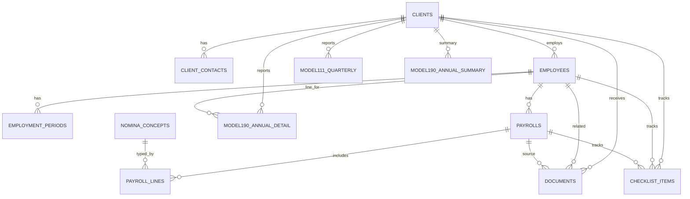

# ValerIA Onboarding Automation — Full Technical Spec (Markdown)

> **Purpose:** Consolidate the Catalan email proposal + our design decisions into a single English, implementation‑ready spec you can paste into a coding assistant LLM. Includes workflow, data model, AI extraction schema, n8n architecture, security, testing, and delivery plan.

---

## 1) Executive Summary

Automate new‑client onboarding for a Spanish payroll services company that handles frequent **altas/bajas** and needs **all payslips (“nóminas”) across the fiscal year** to generate **Models 111 (quarterly) and 190 (annual)**, employment certificates, and sick‑leave calculations.

**Approach:**  
- n8n drives onboarding, checklist creation, drip reminders, file ingest, AI extraction, validation, and reporting.  
- Multimodal AI (OCR → LLM) extracts structured fields from PDFs/Excels—even with format variability—into a normalized DB.  
- Outputs: data aggregates for 111/190, employment certificates, and IT (sick‑leave) calculations for review and export.  
- Delivered as a **Dockerized** package; storage can be Drive/S3; optional **Metabase** for BI dashboards.

**In scope:** Onboarding, document intake, AI parsing, DB, reminders, reporting data aggregation.  
**Out of scope (initial):** Automatic submission to tax authorities; deep ERP/HR integrations (can be phased next).

---

## 2) Business Goals & Success Metrics

- **Reduce manual collection time** by ≥70%.  
- **Coverage of required payslips** per employee per fiscal year ≥99%.  
- **Extraction accuracy** (totals, bases, withholdings) ≥97% on validated samples; flag remainder for review.  
- **Submission readiness**: Complete, validated aggregates for 111/190 by deadlines with audit traceability.

---

## 3) Assumptions & Constraints

- Spanish market; documents in ES/CA with heterogeneous formats.  
- Existing internal tool can list all employees per client and period (source of truth for who requires data).  
- GDPR applies; minimize personal data sent to external APIs; allow self‑hosted fallback.  
- Files delivered via email uploads or structured templates (Excel/Form).  
- Packaging in Docker; Drive/S3 acceptable for storage; optional Metabase instance bundled.  
- Timezone: **Europe/Madrid**.

---

## 4) High‑Level Architecture

```mermaid
flowchart LR
  subgraph Client-Side
    U[Client User] -->|Uploads via email/form| ING[Ingestion Endpoint]
  end

  subgraph Orchestration (n8n)
    TRG[Onboarding Trigger] --> SS[Fetch employee roster (SS tool)]
    SS --> CL[Checklist Builder]
    CL --> DRIP[Email/Drip Reminders]
    ING --> Q[Queue/Watcher]
    Q --> OCR[OCR/Text extraction]
    OCR --> AI[LLM Parser (GPT-4o or local)]
    AI --> VAL[Validation & Rules]
    VAL --> DB[(PostgreSQL)]
    VAL --> LOG[Audit Trail]
  end

  DB --> RPT[Aggregations: Model 111/190]
  DB --> CERT[Employment Certificates]
  DB --> IT[Sick Leave Calcs]
  DB --> BI[(Metabase)]

  subgraph Storage
    FS[(Drive/S3/NAS)] <--> ING
    FS <--> LOG
  end

  RPT --> OUT[Exports (CSV/PDF)]
  CERT --> OUT
  IT --> OUT
```
**Tooling:** n8n for orchestration, GPT‑4o (or local LLM) for PDFs/Excel, PostgreSQL for structured data, Drive/S3 for file storage, optional Metabase; packaged with Docker.

---

## 5) Workflow Design (n8n)

### 5.1 Core Flow (end‑to‑end)

```mermaid
flowchart TD
  A[New client signed] --> B[AM inputs client basics (Form/Webhook)]
  B --> C[Call SS tool → list all employees for fiscal year]
  C --> D[Create client + employee scaffolding in DB]
  D --> E[Generate checklist items (required payslips)]
  E --> F{Collection mode?}
  F -->|Email| G[Send welcome + secure upload link]
  F -->|Template| H[Send Excel/Form with fields]
  G --> I[Drip reminders until complete]
  H --> I
  I --> J[Ingestion watcher (email inbox / webhook)]
  J --> K[OCR (images/PDF) + text normalization]
  K --> L[LLM extraction → JSON]
  L --> M[Validate, reconcile, flag anomalies]
  M --> N[Persist to DB: payrolls + lines]
  N --> O[Aggregate: 111/190, Certs, IT]
  O --> P[Notify AM; export packages]
```

### 5.2 n8n Node Map (indicative)

- **Triggers:** `Webhook` (CRM), `Manual`, `Schedule` (quarterly/annual)  
- **Integrations:** `HTTP Request` (SS tool), `IMAP Email` (attachments), `Drive/S3` (file ops)  
- **Processing:** `Function`, `Split in Batches`, `Wait/IF`, `Error Trigger`  
- **AI:** `OCR` (e.g., Tesseract/cloud), `OpenAI` (GPT‑4o) or HTTP call to local LLM  
- **DB:** `Postgres` (Insert/Update/Query)  
- **Notifications:** `SMTP/SendGrid` (welcome, reminders, ready notices)  
- **Audit:** enrich `documents` + `checklist_items` with processing metadata

---

## 6) Data Model

### 6.1 ER Diagram



### 6.2 Tables (concise)

- **clients**: fiscal name, NIF, CCC SS, contact emails, active, timestamps.  
- **client_contacts**: name, email/phone, role, primary flag.  
- **employees**: client_id, full_name, NIF, SS number, DoB, active.  
- **employment_periods**: employee_id, alta/baja dates, contract/jornada, pct.  
- **documents**: client/employee/payroll links, type, storage_uri, hash, received/processed, status, OCR text, metadata.  
- **payrolls**: employee_id, period dates, pay_date, bruto/neto, IRPF bases & withholdings (money/kind), SS employee total, base_cc, base_cp, indemnizacion, extra_json.  
- **payroll_lines**: payroll_id, concept_code/desc, flags (devengo/deduccion/tributa/cotiza/en_especie), units, amounts.  
- **nomina_concepts**: code dictionary with fiscal flags + Model 190 mapping; supports client‑specific overrides.  
- **checklist_items**: who/what/when for required uploads; status, reminders, notes.  
- **model111_quarterly**: client/year/quarter aggregates for IRPF base & withholdings.  
- **model190_annual_detail**: per employee, fiscal totals for monetary/in‑kind, IT portions, retentions, indemnizaciones, SS (informative).  
- **model190_annual_summary**: client/year totals for cross‑check.

### 6.3 Minimal DDL (PostgreSQL — excerpt)

```sql
-- Employees & employment periods
CREATE TABLE employees (
  id SERIAL PRIMARY KEY,
  client_id INT NOT NULL REFERENCES clients(id) ON DELETE CASCADE,
  full_name TEXT NOT NULL,
  nif TEXT, nss TEXT,
  date_of_birth DATE,
  active BOOLEAN DEFAULT TRUE,
  created_at TIMESTAMPTZ DEFAULT now(), updated_at TIMESTAMPTZ DEFAULT now()
);

CREATE TABLE employment_periods (
  id SERIAL PRIMARY KEY, employee_id INT NOT NULL REFERENCES employees(id) ON DELETE CASCADE,
  alta_date DATE NOT NULL, baja_date DATE,
  contract_type TEXT, jornada_type TEXT, jornada_pct NUMERIC, notes TEXT
);

-- Payroll header & lines
CREATE TABLE payrolls (
  id SERIAL PRIMARY KEY, employee_id INT NOT NULL REFERENCES employees(id) ON DELETE CASCADE,
  employment_period_id INT REFERENCES employment_periods(id) ON DELETE SET NULL,
  period_start DATE NOT NULL, period_end DATE NOT NULL, pay_date DATE,
  period_year INT GENERATED ALWAYS AS (EXTRACT(YEAR FROM period_end)) STORED,
  period_month INT GENERATED ALWAYS AS (EXTRACT(MONTH FROM period_end)) STORED,
  bruto_total NUMERIC, neto_total NUMERIC,
  irpf_base_monetaria NUMERIC, irpf_base_especie NUMERIC,
  irpf_retencion_monetaria NUMERIC, irpf_retencion_especie NUMERIC,
  ss_trabajador_total NUMERIC, base_cc NUMERIC, base_cp NUMERIC,
  indemnizacion NUMERIC, extra_json JSONB, created_at TIMESTAMPTZ DEFAULT now(), updated_at TIMESTAMPTZ DEFAULT now()
);

CREATE TABLE nomina_concepts (
  concept_code TEXT PRIMARY KEY,
  short_desc TEXT, long_desc TEXT,
  tributa_irpf BOOLEAN, cotiza_cc BOOLEAN, cotiza_cp BOOLEAN, en_especie BOOLEAN,
  default_group TEXT, model190_box TEXT
);

CREATE TABLE payroll_lines (
  id SERIAL PRIMARY KEY, payroll_id INT NOT NULL REFERENCES payrolls(id) ON DELETE CASCADE,
  concept_code TEXT REFERENCES nomina_concepts(concept_code),
  concept_desc TEXT, is_devengo BOOLEAN, is_deduccion BOOLEAN,
  tributa_irpf BOOLEAN, cotiza_cc BOOLEAN, cotiza_cp BOOLEAN, en_especie BOOLEAN,
  units NUMERIC, importe_devengo NUMERIC, importe_deduccion NUMERIC
);
```

> Indexes recommended: `(client_id)`, `(employee_id, period_year, period_month)`, `(payroll_id)`, `(status)` for checklist, etc.

---

## 7) AI Extraction

### 7.1 Pipeline
1. **OCR** (scanned PDFs/images): Tesseract or cloud OCR → UTF‑8 text.  
2. **Normalization:** remove headers/footers/artifacts; split into header, totals, line items.  
3. **LLM parse (GPT‑4o or local):** prompt with few‑shot examples → strict JSON.  
4. **Validation:** totals reconciliation; semantic checks (e.g., CC base excludes overtime; CP includes it).  
5. **Persist:** upsert to `payrolls` + `payroll_lines`; attach parsing logs to `documents`.

### 7.2 Extraction Output Schemas

**Payroll header JSON**
```json
{
  "employee": {"full_name": "", "nif": "", "nss": ""},
  "period": {"year": 2025, "month": 3, "start_date": "2025-03-01", "end_date": "2025-03-31", "pay_date": "2025-03-31"},
  "totals": {
    "bruto_total": 0.0, "neto_total": 0.0,
    "irpf_base_monetaria": 0.0, "irpf_base_especie": 0.0,
    "irpf_retencion_monetaria": 0.0, "irpf_retencion_especie": 0.0,
    "ss_trabajador_total": 0.0, "base_cc": 0.0, "base_cp": 0.0,
    "indemnizacion": 0.0
  }
}
```

**Payroll line JSON**
```json
{
  "concept_code": "001",
  "concept_desc": "Salario base",
  "is_devengo": true,
  "is_deduccion": false,
  "tributa_irpf": true,
  "cotiza_cc": true,
  "cotiza_cp": true,
  "en_especie": false,
  "units": 1,
  "importe_devengo": 1200.00,
  "importe_deduccion": 0.00
}
```

> **Concept codes:** Practical mapping to start: 001–399 ordinary monetary (usually cotiza+tributa), 600–699 in‑kind/exempt, 700–799 deductions. Store canonical mappings in `nomina_concepts`; allow client‑specific overrides.

### 7.3 Prompting (sketch)
- System: “You are a strict payroll parser for Spanish payslips. Output only JSON conforming to schema X…”  
- User: “Given this text block… extract header as schema A and lines as array of schema B…”  
- Tools: use function/tool schemas to enforce valid JSON.

---

## 8) Validation Rules & Aggregations

- **Arithmetic:** `Σ devengos – Σ deducciones == neto_total` (±0.01).  
- **IRPF bases/withholdings:**  
  - `irpf_base_monetaria + irpf_base_especie ≈ taxable gross`  
  - `irpf_retencion_total == Σ IRPF deduction lines`  
- **Bases:** `base_cc` excludes overtime; `base_cp` includes overtime/extra hours.  
- **Model 111 (quarterly):** sum IRPF base/withholdings across quarter.  
- **Model 190 (annual, per employee):** monetary vs. in‑kind perceptions, IT (no company complements), retentions, indemnizaciones; optional SS worker (informative).  
- **Anomalies:** missing months vs. roster; negative/zero totals; outlier IRPF %; unmatched identity.

---

## 9) Email & Drip Campaign

- **Welcome:** checklist summary + secure upload link **or** Excel/Form template.  
- **Reminders:** Day 3, 7, 14; stop when checklist complete. Tone: helpful, benefit‑oriented.  
- **Completion notice:** summary of received items, remaining gaps, and “review ready” exports.

---

## 10) Security & GDPR

- **Minimize data:** redact NIF/NSS before LLM where feasible; use employee GUID for joins.  
- **At‑rest encryption:** DB/storage; hashes for file integrity.  
- **In‑transit:** HTTPS/TLS; signed URLs for uploads.  
- **LLM options:** OpenAI GPT‑4o with data controls **or** self‑hosted LLM.  
- **Retention:** configurable; auto‑purge raw OCR & transient artifacts post‑success.  
- **Audit:** processing metadata on `documents` and `checklist_items`.

---

## 11) DevOps & Packaging

- **Dockerized** delivery: n8n, PostgreSQL (or external), optional Metabase and OCR helper.  
- **Config via env vars:** DB URI, storage credentials, SMTP, LLM provider keys, SS tool base URL/token.  
- **Observability:** n8n execution logs; optional Metabase dashboards (ingestion throughput, completion %, accuracy, exceptions).

---

## 12) Implementation Plan & Hours (estimate)

| Phase | Scope | Hours |
|---|---|---:|
| Workflow design | n8n blueprints, node scaffolding, SS fetch, checklist | 10–15 |
| DB & templates | PostgreSQL schema, seed concept codes, export skeletons | 5–8 |
| AI pipeline | OCR wiring, GPT‑4o/local LLM prompts, JSON validation | 15–20 |
| Testing | E2E dry runs, edge cases, accuracy tuning | 10–12 |
| UX & comms | Emails, form/Excel, drip copy, AM notifications | 5 |
| Deploy & handover | Docker compose, runbooks, training | 5 |
| **Total** |  | **≈ 60** |

---

## 13) Deliverables

- n8n workflows (onboarding, drip, ingestion, AI parsing, reporting).  
- PostgreSQL schema + migrations + seed for `nomina_concepts`.  
- Email templates (welcome, reminder, completion).  
- Exporters (CSV/Excel/PDF) for 111/190 aggregates & certificates.  
- Docker compose + `.env.sample` + runbook.  
- Metabase dashboards (optional).

---

## 14) Testing & Acceptance

- **Happy path:** multi‑employee client; complete checklist; 97%+ accuracy; aggregates match manual calculator.  
- **Formats:** test at least 5 heterogeneous payslip layouts (PDF text, image scans, Excel).  
- **Edge cases:** 1‑day contracts; mid‑month alta/baja; in‑kind only; large indemnización; sick‑leave months (IT).  
- **Resilience:** retry OCR; fallback parse; error surfaces to AM; no data loss.  
- **Security:** redaction works; storage ACLs enforced; audit trail present.

---

## 15) Future Extensions

- Direct submission helpers for 111/190 (where feasible).  
- Customer portal with upload status and self‑service fixes.  
- Auto‑classification for non‑payslip docs (contracts, IDs).  
- Fine‑tuned local model for higher accuracy on your formats.  
- SLA dashboards (time‑to‑complete, reminder efficacy).

---

## 16) Appendix

### 16.1 Model 111/190 Aggregation (logic sketch)

- **111 (quarter):**  
  - `base_irpf_total = Σ(irpf_base_monetaria + irpf_base_especie)` in Q  
  - `retencion_irpf_total = Σ(irpf_retencion_monetaria + irpf_retencion_especie)` in Q

- **190 (annual, per employee):**  
  - Monetary perceptions = Σ ordinary monetary devengos (exclude exempt)  
  - In‑kind = Σ en_especie values; track taxable portion  
  - IT perceptions (exclude company complements)  
  - Retentions = Σ IRPF lines (incl. in‑kind taxed)  
  - Indemnizaciones captured separately

### 16.2 Example Concept Mapping (seed)

| concept_code | short_desc       | tributa_irpf | cotiza_cc | cotiza_cp | en_especie | default_group |
|---|---|---|---|---|---|---|
| 001 | Salario base           | true | true | true | false | ordinaria |
| 120 | Plus convenio          | true | true | true | false | ordinaria |
| 301 | Horas extra            | true | false | true | false | variable |
| 610 | Dietas exentas         | false | false | false | false | especie |
| 700 | IRPF                   | null | null | null | null  | deduccion |
| 730 | SS Trabajador (total)  | null | null | null | null  | deduccion |
| 900 | Indemnización despido  | false | false | false | false | indemnizacion |

> Adjust per actual payroll software; use `nomina_concepts` to normalize.

### 16.3 Environment Variables (example)

```
POSTGRES_DB=valeria
POSTGRES_USER=valeria
POSTGRES_PASSWORD=changeme

# n8n
N8N_HOST=localhost
N8N_PROTOCOL=http
WEBHOOK_URL=http://localhost:5678/
N8N_BASIC_AUTH_ACTIVE=true
N8N_BASIC_AUTH_USER=admin
N8N_BASIC_AUTH_PASSWORD=supersecret
GENERIC_TIMEZONE=Europe/Madrid

# LLM
LLM_PROVIDER=openai         # or local
OPENAI_API_KEY=sk-...

# Storage (MinIO/S3-compatible)
S3_ENDPOINT=http://minio:9000
S3_REGION=eu-west-1
S3_BUCKET=valeria-docs
S3_ACCESS_KEY=minioadmin
S3_SECRET_KEY=minioadmin
S3_USE_SSL=false

# MinIO
MINIO_ROOT_USER=minioadmin
MINIO_ROOT_PASSWORD=minioadmin

# Metabase (uses same Postgres; ensure DB 'metabase' exists)
```

---

## Image & Graph Placeholders

If you want to include your images/graphs in the final Markdown:

```md


```
